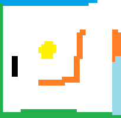
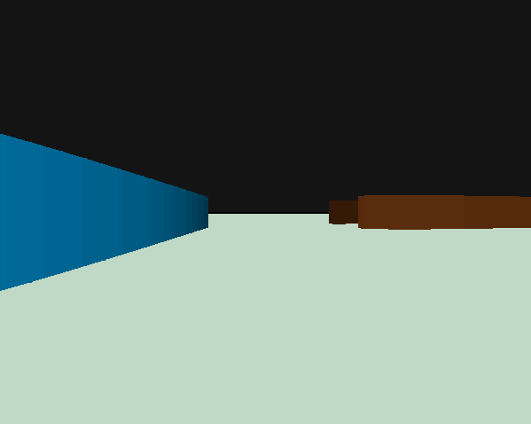
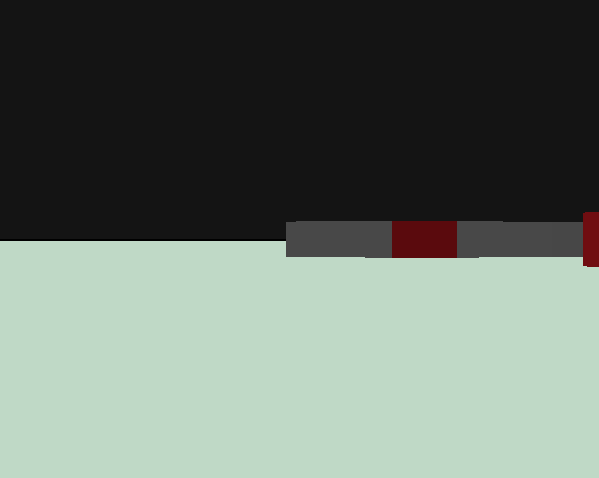

# raycaster
1990s-style 3D graphics engine supporting grid-based wall geometry and featuring mouselook FPS controls, collision detection and a primitive drag model.

Draw an image in msPaint and the program will convert it to a map automatically! (white pixels are read as empty space)

Click or press Space to "shoot" and destroy walls.

TODO:
- [ ] Add texture mapping
- [x] Add collision detection
- [ ] Add jumping, crouching, flying
- [ ] Add viewbobbing

-------------------
SAMPLE:
Input map:

